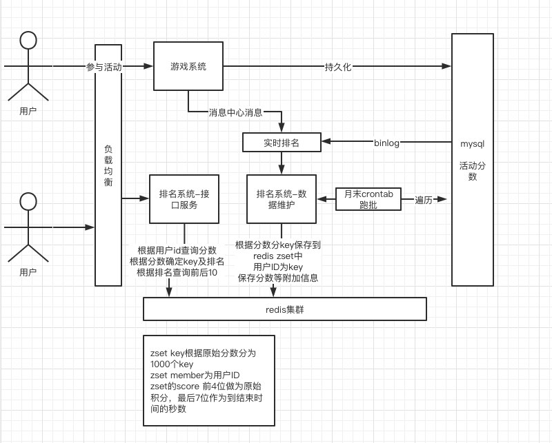

# 题目描述：
***

#### 你开发了⼀个游戏，⽇活跃⽤户在10万⼈以上。请设计⼀个活动排⾏榜系统。
* 在每⽉活动中，玩家得到的活动总分为 0 到 10000 之间的整数。
* 在每⽉活动结束之后，需要依据这⼀活动总分，从⾼到低为玩家建⽴排⾏榜。
* 如果多位玩家分数相同，则按得到指定分数顺序排序，先得到的玩家排在前⾯。
* 系统提供玩家名次查询接⼝，玩家能够查询⾃⼰名次前后10位玩家的分数和名次。
* 请使⽤ UML 图或线框图表达设计，关键算法可使⽤流程图或伪代码表达。


#### 分析
* 活动之后建立排行榜，数据是静态的不需要变更，主要压力在查询上，可在结束后crontab跑批。如结束后需立即出排名使用消息中心提前维护实时排名
* 分数是固定的10000个，可以根据分数分段存储，分数存储可以用int16
* 分数相同是先得分的在前面，根据最后一次得分时间正序，
* 查询前后相邻10位及排名，双向链表或根据双指针或根据存储位置反推
* 用户ID按int32假设
* 日活10W用户量按200~1000W设计，内存占用5G内(5k大概500k)，峰值QPS10W
* 与redis zset场景类似 跳表+hash 相同分数按得分时间排序，可以通过把时间(到结束时间的)加到分数后来实现 
* 时间差的最大值是(60*60*24*31=2678400) 分数的前5位分配给实际得分，最后7位留给时间
* 可能的问题：mysql原始得分查询速度优化，保存入redis的速度优化、redis大key性能问题、峰值查询redis计算压力、负载均衡、高可用
* 根据分数分片后需一次性先ZCARD读取到全部分片内的个数用于计算排名

#### 模型接口
* init 初始化存储
* add 添加用户分数 id(5000W int32) 分数(1W int16) 得分时间戳(一个月不到300W秒 int32)
* batchAdd 批量添加用户分数
* getByID 根据用户ID获取排名 

* 查询流程
```
每个key存10分范围内
预先查出来每个key内用户数保存到数组，可以得到分数段排名

先根据用户ID查出来分数
根据分数计算出来所处key
查询用户在key内的排名加上分数段排名得出来总排名

根据总排名计算前后10排名范围，根据分数段排名计算出来key内排名及key值
zrevrange 根据排名查询出来结果
```

#### 数据结构
* redis zset key 按月份+分组 R:202208:0
* zset key根据原始分数分为1000个keyzset 
* zset member为用户ID
* zset的score 前4位做为原始积分，最后7位作为到结束时间的秒数


#### 系统设计



#### 简单样例
同目录代码 rank_redis.go


